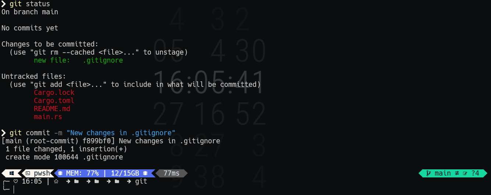
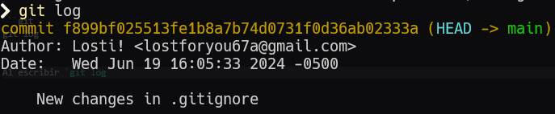
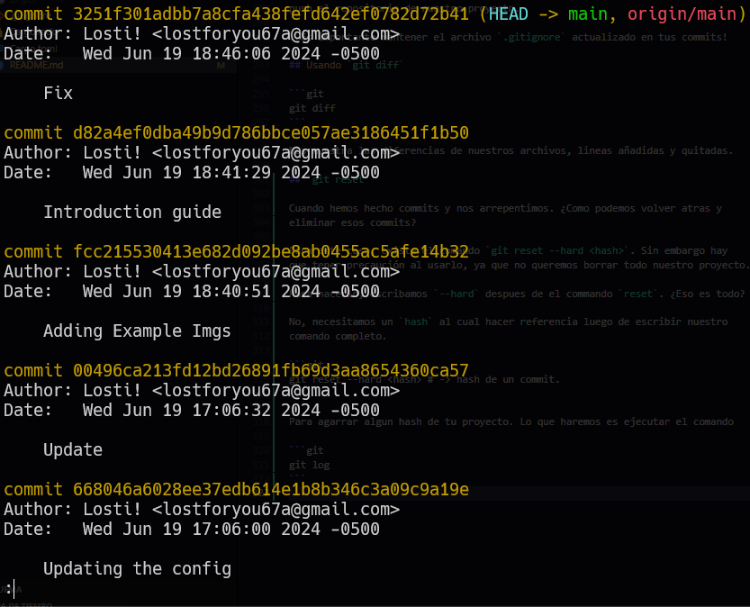
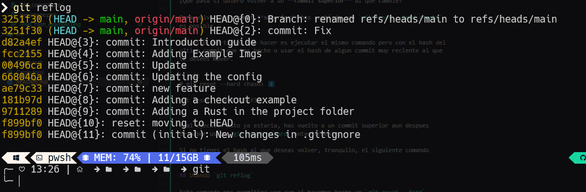
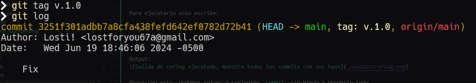

# Introducción a Git

Git es una hermosa herramienta de control de versiones,
nos permite organizar nuestra app/projecto en diferentes
versiones para no perdernos en el desarrollo y si en algun
momento tenemos un error muy complicado de resolver o algo
que rompe nuestra app podemos volver a una versión anterior
facilmente!

Usar Git aumenta mucho nuestra productividad, tanto para
projectos personales como para aportar a otros.

Esta guía no cubre la instalación de git en tu computador,
asi que por favor mira algun video que cubra la instalación.

Sugerencias de guías aparte de este repositorio:

[Fazt](https://youtu.be/HiXLkL42tMU?si=CHgD-ORd7SwZuQAU)
[Midudev](https://youtu.be/niPExbK8lSw?si=8P23TE-sVVTw_oK-)
[MoureDev](https://youtu.be/3GymExBkKjE?si=2NA8AQnpoTKLG7ii)

Estos videos incluyen:

- Instalación
- Introducción
- Explicación mas detallada
- Ver en practica lo enseñado

## Comandos basicos de Git

Comando Version:

```git
git -v
git --version
```

Comando Help:

```git
git -h
git help
git --help
```

Comando de configuración:

Muestra las configuraciones de git

```git
git config
```

Flags de configuración:

`--global`
`--system`
`--local`
`--worktree`
`-f | --file`
`--blob`

¿Como se usan?

Para usar una flag cuando quieres configurar git, tienes que usar la
flag justo despues de `git config` como en este ejemplo.

```git
git config --global
```

Despues, para crear la configuración de usuario **global**, como es el
caso de esta pequeña guia. escribiremos `user` despues de la `flag`.

```git
git config --global user
```

Y crearemos nuestro `name` de esta forma:

```git
git config --global user.name "tu nombre aqui"
```

Y ahora añadiremos nuestro gmail para la configuración.

```git
git config --global user.gmail "tu gmail aqui"
```

---

## Usando git para tus proyectos

¿Como inicializo en un directorio git para usar el control de versiones?

Primero entra al directorio de tu proyecto desde la terminal y luego
escribe el siguiente comando en la terminal:

```git
git init
```

Inicializara git en tu directorio actual, con esto podras empezar a
hacer el control de versión con git.

¿Como guardo una fotografia de mis codigo?

```git
git add <file>
# Ejemplos ⬇️
git add . # -> Añade todos los ficheros de tu directorio
git add main.rs # -> Añade un solo archivo
git add Cargo.lock # -> Añade un solo archivo
git add Cargo.toml # -> Añade un solo archivo
git add .gitignore # -> Añade un solo archivo
```

¿Como reviso que archivos han sido añadidos por `git add ...`?

Es realmente sencillo! Basta con usar:

```git
git status
```

Para que te de un resumen de todo lo añadido y lo que falta añadir.

Comando commit:

`git commit` nos permite generar de los `git add`
crear un `commit` con todos los cambios nuevos que
hemos hecho en esta.

Flags:

`-m` -> Asociar mensaje al commit

```git
git commit -m "<message here>"
```



Este primer commit nos da muchas cosas, nos muestra tanto que ficheros
cambiaron como cuantos se han añadido. Tambien muestra un Hash de
nuestro commit (f899bf0), siempre generara uno diferente para cada commit.

Comando log:

```git
git log
```

Al escribir `git log` nos mostrara los commits generados
con información al respecto de estos.



En la imagen vemos que nos muestra nuestro commit con el Hash completo
y con la información que hemos configurado al inicio de esta guia, sin
haber hecho la configuración global no nos dejara hacer commits!

Asi espero que lo hayas hecho, con lo visto hasta ahorita esto ya puedes
empezar a hacer tus commits de tus proyectos sin problema alguno. Ya que
todos estos comandos son los que necesitas para un flujo basico de trabajo
con git.

Flags:

`--graph`
`--pretty=oneline`
`--decorate`
`--all`
`--oneline`

Uso:

```
git log --graph # -> lo mismo que git log solo, pero resalta como un arbol los commits.
git log --graph --pretty=oneline # -> resume la información de los commits.
git log --graph --decorate --al --oneline # -> resume mucho mas la información de los commits:3!
```

## Usando `git checkout` y `git reset`

Nos permite colocarnos en un punto concreto de una imagen de un
fichero/archivo concreto. En este caso, en la carperta de [example.rs](./src/checkout/example.rs)
he hecho dos commits para poder usar `checkout` sin problemas en este ejemplo.

Para usarlo haremos lo siguiente:

```git
# git checkout <filePath> <- dirección del archivo en tu workspace
# git checkout tags/<tagName> <- dirección al tag que queremos
# git checkout <hash> <- Usando git log sacamos x hash de una versión y la ingresamos para ir a esa.
git checkout ./src/checkout/example.rs
git checkout 181b97d50690c4e8fcf1aa7f63a36e405c6aabbd
```

Esto nos permitira ir a una imagen anterior de este fichero/archivo y poder ver como era en la anterior imagen.

Para volver a su estado natural usaremos lo siguiente:

```git
git reset
```

Y ya estariamos como antes.

## Usando `alias`

Para crear un alias, tenemos que acceder a nuestra configuración ⬇️

```git
git config --global alias.<name> "<comando>"
```

Escribimos `alias.<name>` y en name, ponemos el nombre que deseemos.

Para finalizar usamos `alias.<name> "<comando>"` entre las comillas
escribiremos nuestro comando para el alias.

Ejemplo:

```git
git config --global alias.example "log --graph --decorate --al --oneline"
```

Esto modificara nuestro de configuración global, para ver los cambios
consultalo en el siguiente directorio: `C:\Users\<Name>\.gitconfig`

Resultado:

```
[user]
	email = <yourEmail>
	name = <yourName>
[alias]
    example = log --graph --decorate --al --oneline
```

Recuerda que los nombres del alias pueden ser el que tu desees y que esto
resumiria el escribir un alias que resuma muchos flags o comandos en uno
solo y es muy util.

## Usando `.gitignore`

`.gitignore` nos permite omitir archivos de nuestros directorios en el
espacio de trabajo donde estamos. Este fichero se crea en el directorio
raíz.

Ejemplo:

```
└── 📁root
    └── .gitignore
    └── Cargo.lock
    └── Cargo.toml
    └── 📁public
        └── first_commit.png
        └── log_image.png
    └── README.md
    └── 📁src
        └── 📁checkout
            └── example.rs
        └── ignore_this.rs
        └── main.rs
```

Como puedes ver, el archivo .gitignore esta en la raíz del proyecto, ahora
para usarlo tienes que abrir este archivo (despues de haberlo creado) y
simplemente escribir los nombres de archivos y carpetas que quieras ignorar.

En este caso ignoraremos el fichero `./src/ignore_this.rs`, para esto vamos
al `.gitignore` y añadimos esa dirección al archivo

Resultado:

```
/target

# src -> ignore_this.rs
/src/ignore_this.rs
```

Esto ignorara por completo este archivo y no aparecera en proximos commits o
push al repositorio de nuestro proyecto.

> Es importante mantener el archivo `.gitignore` actualizado en tus commits!

## Usando `git diff`

```git
git diff
```

Nos muestra las diferencias de nuestros archivos, lineas añadidas y quitadas.

## `git reset`

Cuando hemos hecho commits y nos arrepentimos. ¿Como podemos volver atras y
eliminar esos commits?

Para este caso, existe el comando `git reset --hard <hash>`. Sin embargo hay
que tener precaución al usarlo, ya que no queremos borrar todo nuestro proyecto.

Para hacerlo, escribamos `--hard` despues de el commando `reset`. ¿Eso es todo?

No, necesitamos un `hash` al cual hacer referencia luego de escribir nuestro
comando completo.

```git
git reset --hard <hash> # -> hash de un commit.
```

Para agarrar algun hash de tu proyecto. Lo que haremos es ejecutar el comando

```git
git log
```

output:



Lo que haremos ahora es elegir algun `hash` al que nos interese volver (con los
primeros 6 caracteres vale o simplemente copia todo el hash).

Luego de obtener el hash al cual querermos volver ejecutaremos finalmente el comando reset:

```git
git reset --hard d82a4ef0dba49b9d786bbce057ae3186451f1b50
```

En este ejemplo use el `hash` completo. Luego de lanzarlo, los commits superiores a
commit con el `hash` d82a4ef... no existiran y sus archivos se eliminaran. Volviendo
al estado anterior de esos commits que se eliminaron.

¿Que pasa si quiero volver a un **commit superior** al que cambie?

Para volver aun commit **superior** has cambiado con `git reset --hard <hash>`
es posible.

Lo unico que tienes que hacer es ejecutar el mismo comando pero con el hash del
ultimo commit que has hecho o usar el hash de algun commit muy reciente al que
te desees mover.

```git
# git reset --hard <hash> ⬇️

git reset --hard 3251f30
```

Y al ejecutar esto ya estaria, has vuelto a un commit superior aun despues
de haber usado `git reset --hard` anteriormente.

Si no tienes el hash al que deseas volver, tranquilo, el siguiente comando
nos ayudara en eso.

## Usando `git reflog`

Este comando nos permitira ver aun si hayamos hecho un `git reset --hard`
todo lo que ha pasado (commits) en nuestro workspace

Para ejecutarlo solo escribe:

```git
git reflog
```

Output:


Ahora con esto, podemos volver a cualquier `commit` sin miedo a perderlo todo.

## `git tag`!

Los `tags` nos sirve para hacer referencia a algo.. pero en que nos sirve los tags
con git?

Los tags como mencione ya, nos sirven para tener referencias a **puntos importantes**
de nuestro repositorio. Ejemplo: versionar nuestro projecto/aplicación

Podemos usar tags para muchas cosas.

- Para hacer referencia a todos los commits del dia 1 de nuestro proyecto
- Hacer referencia a **errores**.
- etc.

Buenas practicas a la hora de hacer un tag:

- Caracteres (incluyendo numeros) minúscula
- Guiones bajos o Guiones y puntos.

```git
# git tag <tagname>
git tag v.1.0
```

Ahora si hacemos un `git log`:



En nuestro output podemos ver que:

```cmd
git log

commit 3251f301adbb7a8cfa438fefd642ef0782d72b41 (HEAD -> main, tag: v.1.0, origin/main)
Author: Losti! <lostforyou67a@gmail.com>
Date:   Wed Jun 19 18:46:06 2024 -0500

    Fix
```

En la salida despues de hacer un `git tag` y `git log` para ver los cambios, nuestro
commit mas reciente ahora tiene un `tag`. Si bien podriamos añadir mas de un `tag` para
tener varios nombres con cual identificar un **punto exacto** de nuestro proyecto.

Lo ideal es usarlo no de forma excesiva, si no de forma consciente.

Para ver tambien cuantos `tags` tenemos creados en nuestro proyecto. Simplemente usemos:

```git
git tag
```

Y nos hara un listado de nuestros tags.

> Los tags nos sirven como una navegación rapida entre commits, es mejor mirarlo de esa forma.

## `git branch` y `git switch`

`git branch` nos permitira crear separaciónes de la rama main. Donde podremos
trabajar aislados de la main, sirve para crear features de forma que no tenga
que interactuar con el trabajo actual en main y poder seguir trabajando en main
sin que ese cambio se note hasta que este completo y lo añadamos a la rama main.

Primero, para consultar las ramas que tenemos en nuestro proyecto ejecutemos:

```
git branch
```

Output:

- main
- ...Otras ramas si ya has creado alguna antes:3!

Por ahora nuestra salida es solo la rama main, por que hasta ahorita no creamos
ninguna otra rama. Pero vamos a crear una de guia.

Para crear otra rama basta con ejecutar lo siguiente:

```
# git branch <branchName>
git branch test
```

Ahora si consultamos de nuevo todas nuestras ramas. El output incluira la nueva
que hayamos creado, en este caso cree la rama test.

Sin embargo, aunque la ya que hemos creado no estamos dentro de esta rama.
¿Como nos movemos a esta nueva rama?

```
# git switch <branchName>
git switch test
```

De esta forma nos podemos mover entre varias ramas! la referencia siempre sera el
commit mas reciente, asi que tenlo en cuenta.
